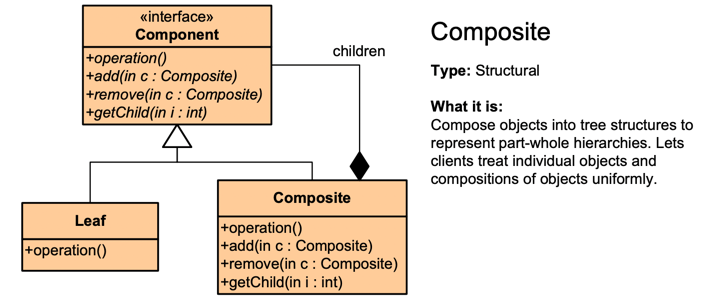
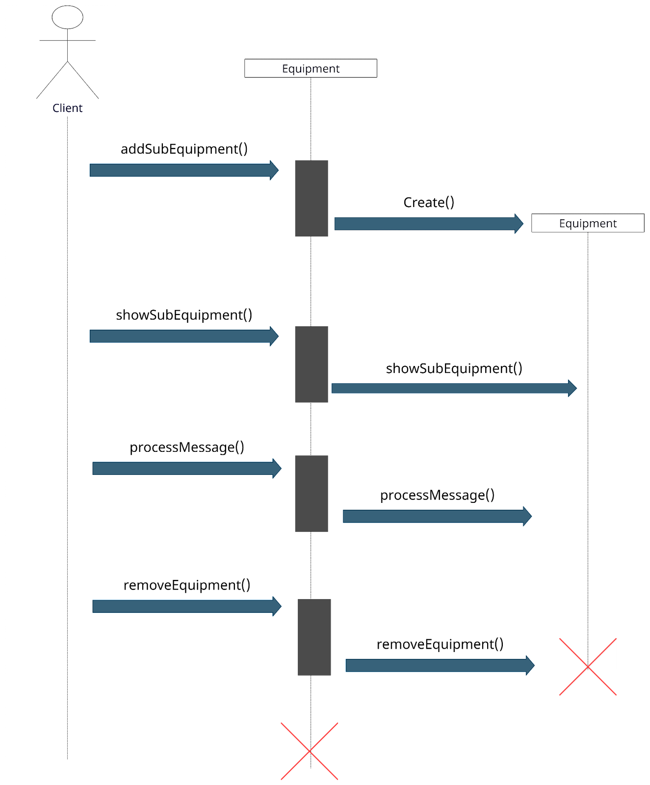
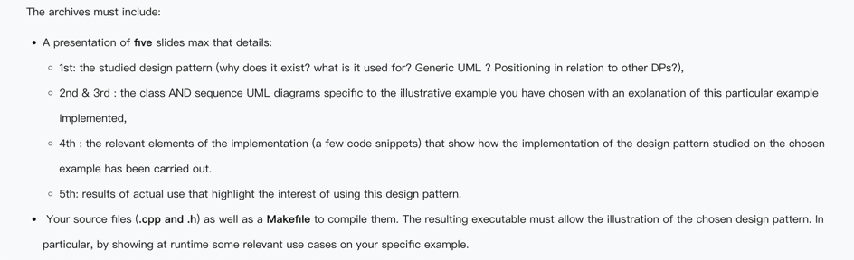
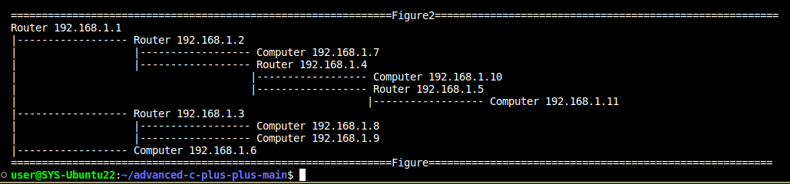

# Design pattern - composite
This is a mini C++ project where we simulated a local internet messaging system by using composite design pattern.

## Presentation of the disign patern

1. Why does it exist ? 
                           
When dealing with Tree-structured data, one difficulty is that branches and leaves are treated differently, which causes more errors. The solution is an interface that allows treating complex and primitive objects uniformly.

2. What is it used for ?
 
Solve recurring design problems by designing flexible and reusable object-oriented software, that is, objects that are easier to implement, change, test, and reuse.

3. Definition:
The composite pattern describes a group of objects that are treated the same way as a single instance of the same type of object.  
 
Generic UML  

## Our implementation :
In order to illustrate the disign pattern, we implemented a small local network, with sevral equipement (computer and router). Each router is linked to sevral equipement. When an equipement receive the order to processe a message, if it is a computer, it displays it, and if it is a router, it orders to each linked equipement to process the message.  
1. UML Diagram of our implementation : 

2. Sequence Diagram of the implementation :
   

  
## Requirement (delete when finished)

 
## Quick Start

The project was compiled using g++ (c++ 17). In order to compile the project, use the command `make main`. Then you can run the executable (using `./main` for linux) 

## What Can the program do : 

1. print a summary of the local network :

2. Simulate a broadcasting operation

TODO : add a snapshot of relevent output

